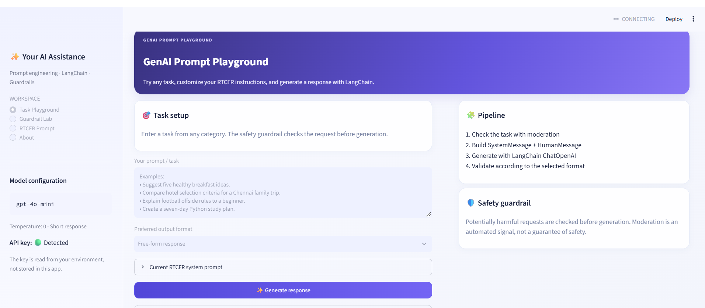
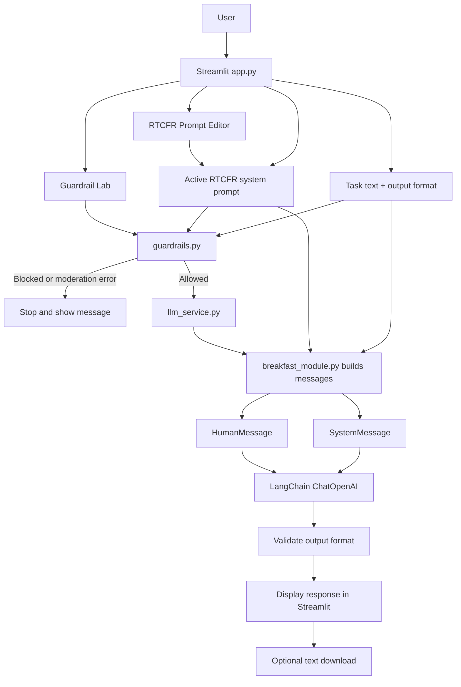

# Your AI Assistance — GenAI Prompt Playground

A lightweight GenAI workspace built with **Streamlit**, **LangChain**, and **OpenAI**. It started as a healthy-breakfast-ideas exercise and was generalized into a reusable playground for tasks across different topics.

## Application Preview



## Documentation Navigation

- [Features](#features)
- [Architecture at a glance](#architecture-at-a-glance)
- [Project structure](#project-structure)
- [Requirements](#requirements)
- [Setup on Windows](#setup-on-windows-command-prompt)
- [How to use the app](#how-to-use-the-app)
- [RTCFR framework](#rtcfr-framework)
- [Request lifecycle](#request-lifecycle)
- [Cost notes](#cost-notes)
- [Git and secret hygiene](#git-and-secret-hygiene)
- [Known scope and limitations](#known-scope-and-limitations)
- [Learning outcomes](#learning-outcomes)

### Detailed Documentation

- [System Architecture](docs/ARCHITECTURE.md) — component responsibilities and architecture details.
- [Project Flow](docs/PROJECT_FLOW.md) — end-to-end workflow and Mermaid flow diagram.
- [GenAI Prompt Playground Comparison (PDF)](docs/GenAI%20Prompt%20Playground_Comparison.pdf) — visual comparison reference.

## Features

- **Free-text task input:** try breakfast ideas, study plans, sports explanations, hotel-selection criteria, and other general tasks.
- **RTCFR prompt editor:** customize a multi-line system prompt using Role, Task, Context, Few-shot, and Response sections.
- **LangChain messages:** uses `SystemMessage` for system instructions and `HumanMessage` for the user's task.
- **OpenAI model integration:** generation is performed through LangChain's `ChatOpenAI` using `gpt-4o-mini`.
- **Pre-generation moderation:** checks the task and active system prompt with the OpenAI Moderation API before calling the generation model.
- **Output-format options:** free-form response, numbered list, Markdown table, or exactly five items.
- **Lightweight output validation:** applies format checks where appropriate.
- **Response comparison:** optionally performs two generation calls and displays both results.
- **Downloads:** save generated responses or comparison results as text files.
- **Standalone assignment script:** `breakfast.py` is retained for the original breakfast assignment workflow.

## Architecture at a glance



See [System Architecture](docs/ARCHITECTURE.md) for component responsibilities, [Project Flow](docs/PROJECT_FLOW.md) for the standalone Mermaid flow, and the [Comparison PDF](docs/GenAI%20Prompt%20Playground_Comparison.pdf) for the visual comparison reference.

## Project structure

```text
your-ai-assistance/
├── app.py                    # Streamlit UI and page navigation
├── breakfast.py              # Standalone Day 5 breakfast assignment
├── breakfast_module.py       # RTCFR prompt, LangChain messages, output validation
├── guardrails.py             # OpenAI moderation check and category policy
├── llm_service.py             # LangChain ChatOpenAI setup and generation
├── requirements.txt           # Python dependencies
├── README.md                  # Project overview and setup
├── .gitignore                 # Excludes secrets, environments, and generated files
├── .env                       # Local API key; do not commit
├── .streamlit/
│   └── config.toml            # Optional Streamlit configuration
├── tests/                     # Project tests
├── images/
│   └── GenAI_APP_UI.png       # Application UI screenshot
└── docs/
    ├── ARCHITECTURE.md
    ├── PROJECT_FLOW.md
    └── GenAI Prompt Playground_Comparison.pdf
```

The structure above shows the expected documentation assets. If your screenshot uses a different filename or extension, update the Markdown image path accordingly. Keep `.env` as a local-only file; it is shown above only to explain local configuration and must never be committed.

## Requirements

- Python 3.12 recommended for the current local setup
- An OpenAI API key with access to the configured chat model
- Python packages listed in `requirements.txt`

## Setup on Windows (Command Prompt)

Run these commands from the project root:

```cmd
py -3.12 -m venv .venv
.venv\Scripts\activate
python -m pip install --upgrade pip
pip install -r requirements.txt
```

Create a local `.env` file in the project root:

```dotenv
OPENAI_API_KEY=your_api_key_here
```

Replace the placeholder with your own key. Never commit `.env`, paste API keys into source code, or include them in screenshots.

Start the app:

```cmd
python -m streamlit run app.py
```

Open the local URL printed by Streamlit, typically `http://localhost:8501`.

## How to use the app

1. Open **Task Playground**.
2. Enter a task in the multiline prompt field.
3. Choose an output format.
4. Optionally open **RTCFR Prompt** to edit the system instructions and select **Apply prompt to Task Playground**.
5. Select **Generate response** for one model call or **Compare responses (2 calls)** to run two generations.
6. Review the output and validation note, then optionally download the result.
7. Open **Guardrail Lab** to check sample or custom text with moderation.

### RTCFR framework

- **Role:** the identity or expertise the assistant should adopt.
- **Task:** the work the assistant should perform.
- **Context:** background, audience, constraints, and preferences.
- **Few-shot:** examples of desired input/output, when available.
- **Response:** output structure, tone, and formatting requirements.

The active RTCFR prompt is retained in the current Streamlit session. It is not permanently written to a file.

## Request lifecycle

1. The user enters a task and selects an output format.
2. The app combines the task and active system instructions for the moderation check.
3. If the configured moderation policy blocks the request, generation is stopped.
4. If moderation allows it, the app builds LangChain `SystemMessage` and `HumanMessage` objects.
5. `llm_service.py` calls `ChatOpenAI`.
6. `breakfast_module.py` performs a lightweight output-format validation.
7. The app displays the response and optionally enables a text download.

**Safety note:** moderation is an automated signal, not a guarantee of safety. Results can be imperfect, and category policy should be reviewed for the intended application. If moderation fails, the app should fail closed rather than call the generation model.

## Cost notes

- A normal generation runs one chat-model call, in addition to the moderation check.
- Compare mode intentionally runs two chat-model calls, in addition to the moderation check.
- The OpenAI moderation endpoint is generally offered without a usage charge, but verify current provider terms.
- Output length and model choice affect generation cost.

## Git and secret hygiene

Do **not** commit:

- `.env` or any file containing API keys
- `.venv/`
- `__pycache__/`, `*.py[cod]`
- `.streamlit/secrets.toml` if it contains credentials
- local logs, temporary exports, or machine-specific files

Usually commit:

- application source files (`app.py`, `breakfast.py`, `breakfast_module.py`, `guardrails.py`, `llm_service.py`)
- `requirements.txt`
- `README.md`, `docs/`
- `.gitignore`
- relevant tests
- `images/` only if the images are used by the project or documentation
- `.streamlit/config.toml` only after checking that it contains configuration, not secrets

Before committing, inspect the exact staged files:

```cmd
git status --short
git diff -- .gitignore README.md
git diff --cached --stat
git diff --cached
```

Then stage deliberately rather than blindly adding everything:

```cmd
git add app.py breakfast.py breakfast_module.py guardrails.py llm_service.py requirements.txt README.md .gitignore docs tests
git status --short
```

If `images/` contains project documentation assets, add it separately after inspection:

```cmd
git add images
```

Do not run `git add .` until you have confirmed `.gitignore` is correct and verified that `.env` is not staged.

## Known scope and limitations

- The RTCFR prompt editor is session-based; edits are not persisted to disk.
- Output validation is intentionally lightweight. It checks response shape; it does not verify factual accuracy.
- Moderation can produce false positives or false negatives.
- Response comparison consumes two generation calls.
- The standalone `breakfast.py` script is kept separate from the Streamlit interface for the original assignment.

## Learning outcomes demonstrated

- LangChain model integration with `ChatOpenAI`
- Chat messages and role separation using `SystemMessage` and `HumanMessage`
- RTCFR prompt design
- Basic pre-generation moderation guardrails
- Output validation and evaluation basics
- Streamlit UI integration and response comparison
