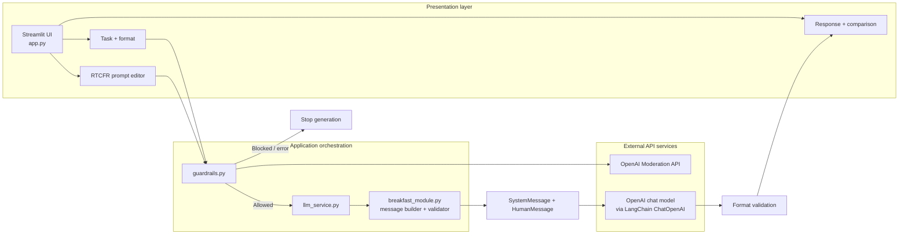
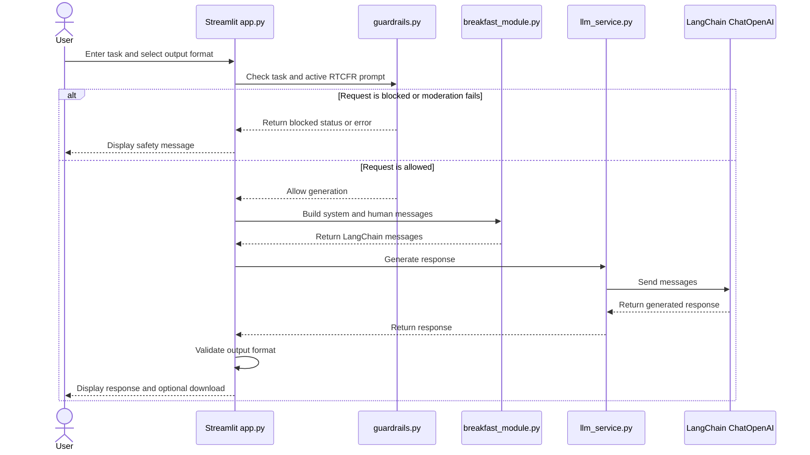

# Architecture — Your AI Assistance

## 1. Overview

Your AI Assistance is a single-process Streamlit application. The UI gathers a task, output-format preference, and the active RTCFR system prompt. The application checks the combined task and prompt through a moderation guardrail before it calls the generative model. Allowed requests are converted into LangChain messages and sent to `ChatOpenAI`. The response is checked against the selected output format and rendered in the UI.

This architecture is designed for a small educational project; it is not a production multi-user service.

## 2. Component responsibilities

| Component | Responsibility |
|---|---|
| `app.py` | Streamlit UI, sidebar navigation, session state, task input, RTCFR editor, moderation flow, response rendering, comparison, and downloads. |
| `breakfast_module.py` | Default RTCFR prompt, creation of `SystemMessage` and `HumanMessage`, and lightweight output-format validation. The filename is retained for continuity with the breakfast assignment even though the functions are now more general-purpose. |
| `guardrails.py` | Sends text to the OpenAI Moderation API and applies the configured blocked-category policy. Returns an allow/block result and moderation details. |
| `llm_service.py` | Reads model configuration, constructs `ChatOpenAI`, and invokes the model using the message builder. |
| `breakfast.py` | Standalone script for the original Day 5 breakfast assignment. It is separate from the Streamlit UI. |
| `requirements.txt` | Declares Python package dependencies. |
| `.env` | Local-only secret configuration, including `OPENAI_API_KEY`; must not be committed. |
| `tests/` | Automated checks, if present. |
| `docs/` | Architecture and flow documentation. |

## 3. Logical architecture

## 4. Detailed request sequence

## 5. Messages and prompt flow

- `SystemMessage` carries the active RTCFR instructions.
- `HumanMessage` carries the user's task and selected output-format instructions.
- `ChatOpenAI.invoke(messages)` returns a message object.
- The service extracts the response content before returning it to the UI.
- The RTCFR prompt editor updates session state. The prompt is not persisted to a configuration file.

## 6. Guardrail behavior

The guardrail is executed before generation to avoid unnecessary model calls for blocked inputs. The app sends both the task and the active system prompt for moderation. If moderation blocks the text, generation stops. If the moderation call raises an error, the app should stop rather than silently bypass the check.

Moderation is not perfect. It can misclassify text and does not replace application-specific policy, human review, or domain controls.

## 7. Model calls and cost behavior

| User action | Moderation checks | Generation calls |
|---|---:|---:|
| Generate response | 1 | 1 |
| Compare responses | 1 | 2 |
| Guardrail Lab check | 1 | 0 |
| Empty task | 0 | 0 |

The exact billing terms for external services can change; consult the provider's current pricing and terms.

## 8. Trust boundaries and secrets

- `.env` is a local secret source; it must stay out of Git.
- API keys must never be hard-coded or placed in README examples as real values.
- User input and model output should be treated as untrusted text.
- Model output is HTML-escaped by the UI before being rendered in a custom HTML container.
- The moderation service is an external dependency; errors should be surfaced and generation should not proceed when the guardrail cannot complete.

## 9. Scope boundaries

Included:
- Streamlit user interface
- RTCFR system-prompt editing
- LangChain messages and model integration
- Basic moderation guardrail
- Format-specific lightweight validation
- Optional two-run comparison
- Original standalone breakfast script

Not included:
- Persistent prompt storage
- User accounts or database
- Retrieval-augmented generation (RAG)
- Agent orchestration
- Production deployment, observability, or rate limiting
