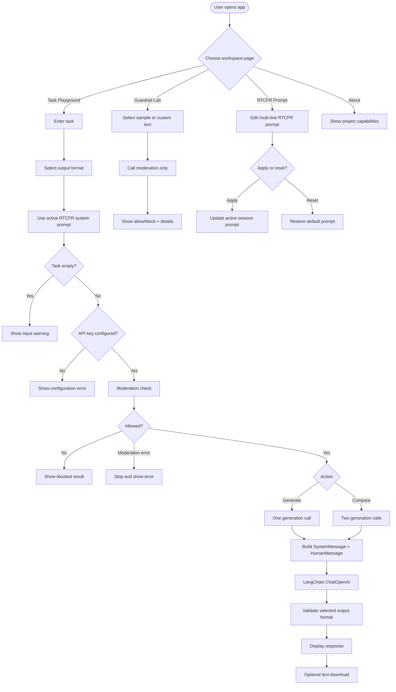
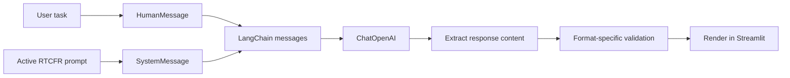
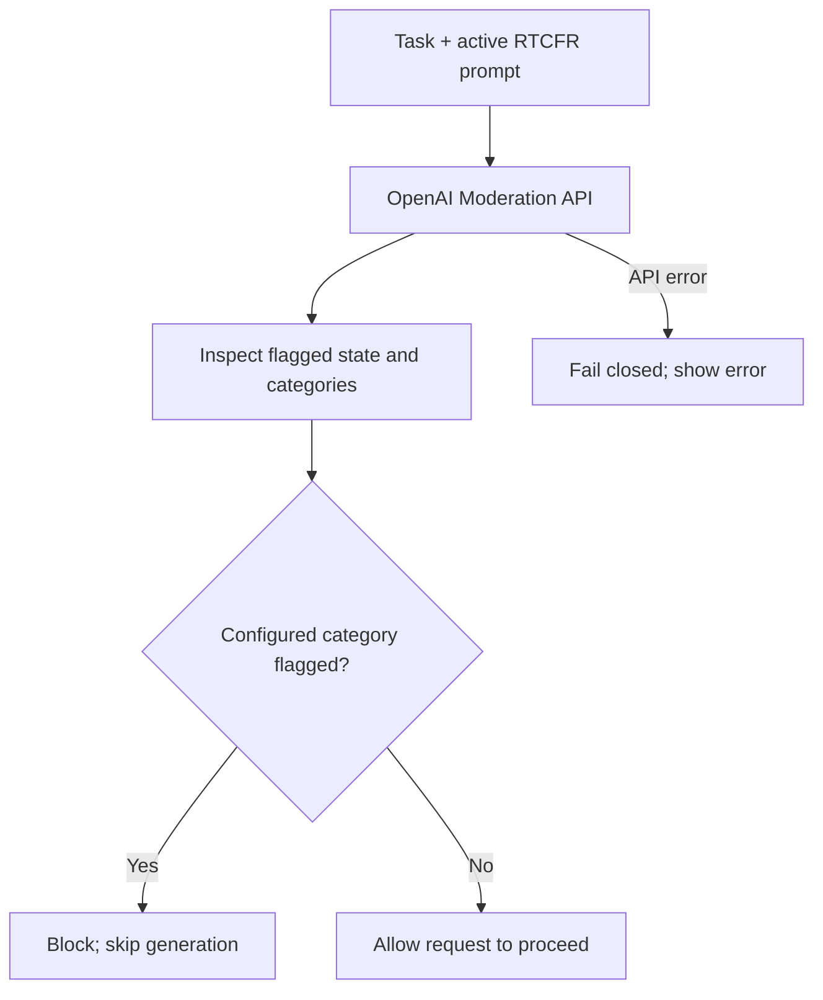
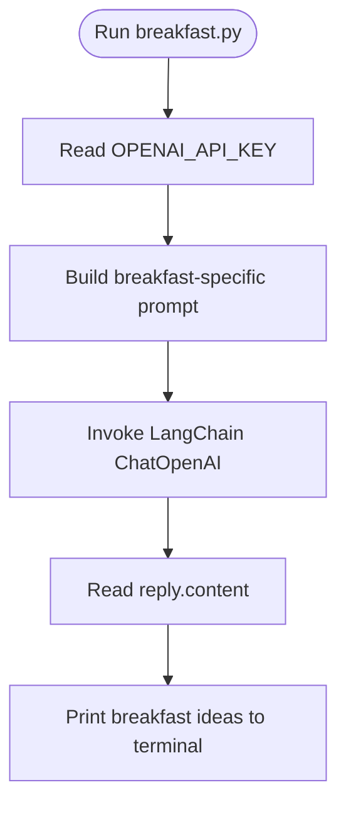

# Project Flow — Mermaid Diagrams

These diagrams document the current frozen code flow. They can be rendered by GitHub in Markdown files that support Mermaid.

## End-to-end application flow

## Generation-only flow

## Guardrail-only flow

## Original assignment script

`breakfast.py` is kept as a standalone path for the original assignment. It should not be confused with the generalized Streamlit path above.

